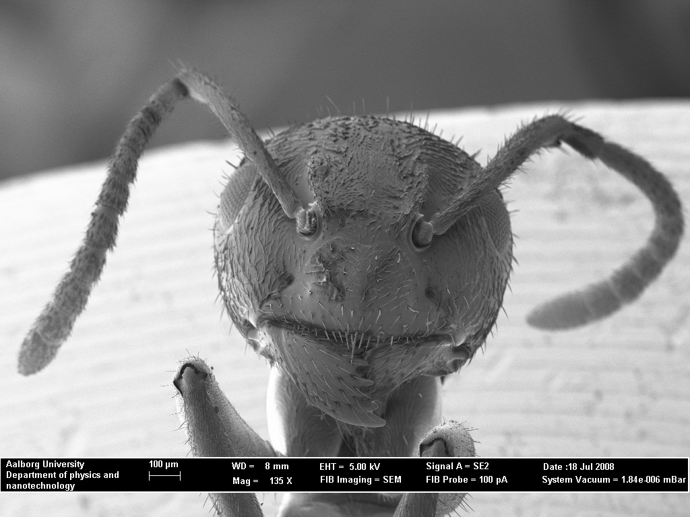
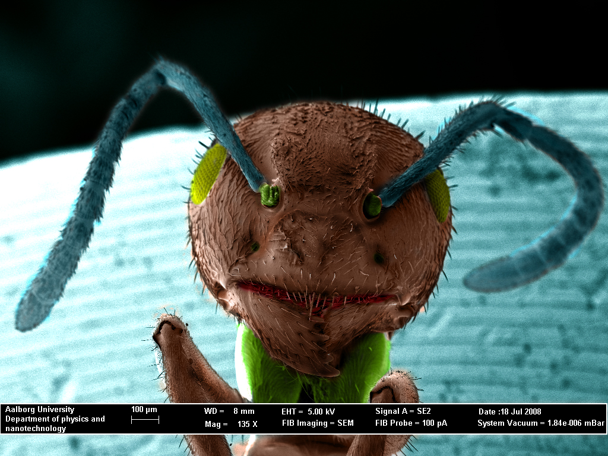
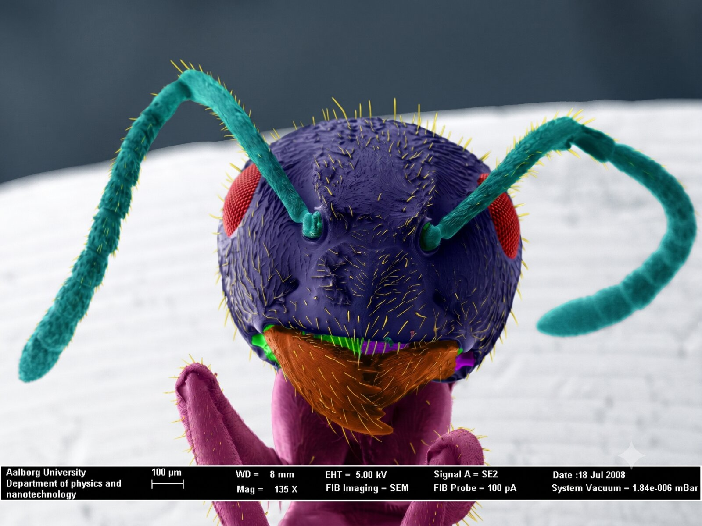
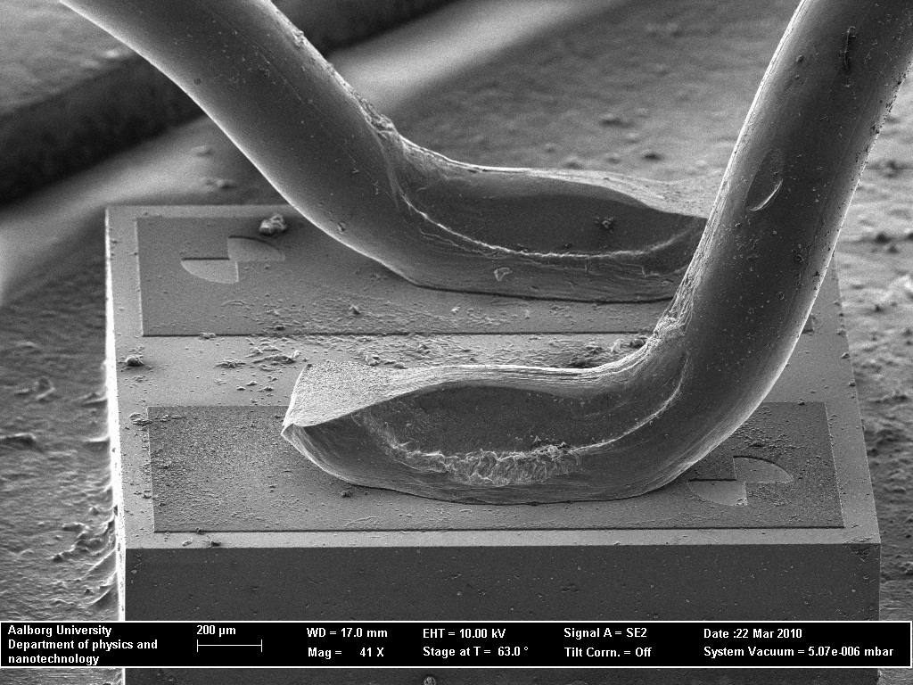
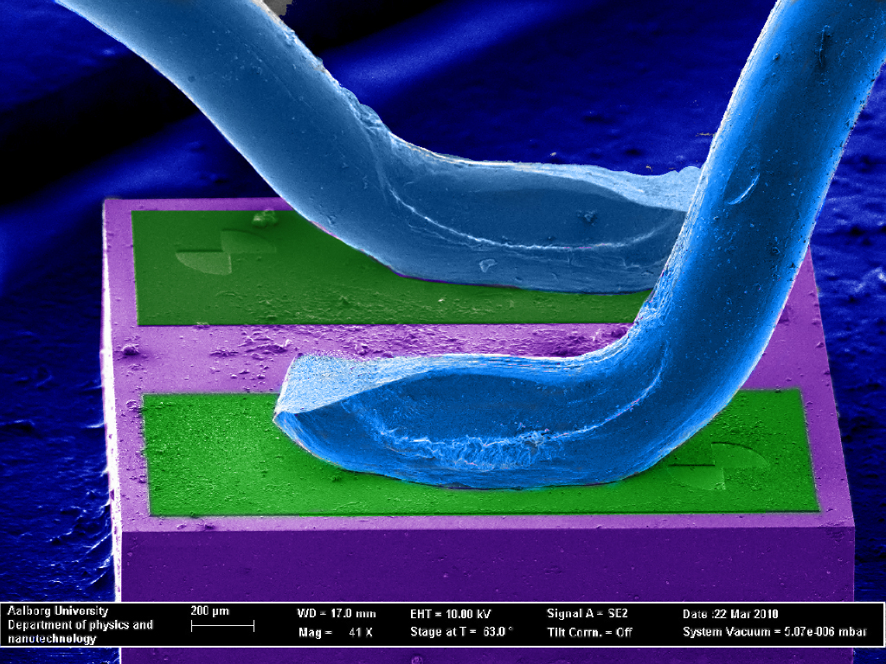
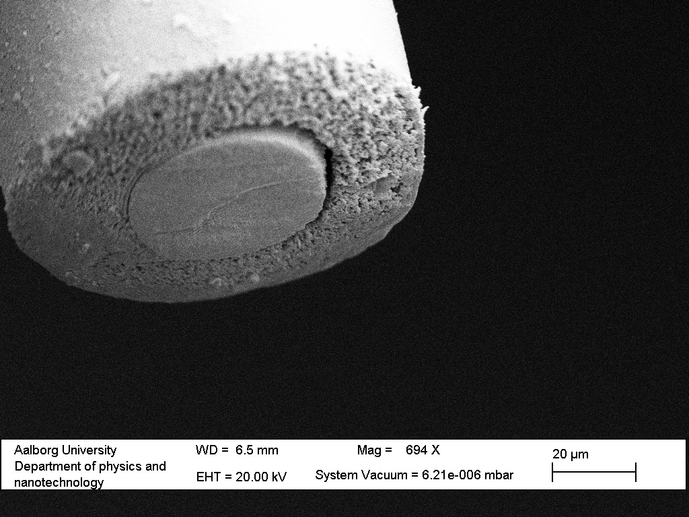
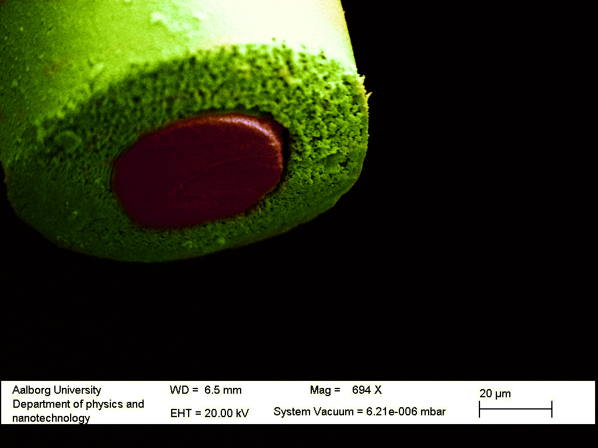

I am a Photoshop enthusiast. I have been adding colours to black-and-white electron-microscope images to give them an attractive look. Each pair below shows the **original micrograph** alongside my **colourised** version. For the ant, I also compare my hand-colourisation with an AI colourisation by **Google Gemini**.

These images are not mine. They are the property of Aalborg University. The images have been coloured here and published by permission of Aalborg University. The original image gallery at Aalborg is [here](http://www.nano.aau.dk/nanolab/equipment/electron-microscope-image-gallery/).

  <figure class="em-pair">
    <figcaption class="subject">Ant — mine vs. Gemini</figcaption>
    

      <figure><figcaption>Original</figcaption></figure>
      <figure><figcaption>My colourisation</figcaption></figure>
      <figure><figcaption>Gemini</figcaption></figure>
    

  </figure>

So it seems like vision models are pretty good at segmentation of Electron microscope images now.

  <figure class="em-pair">
    <figcaption class="subject">Electrical Contacts</figcaption>
    

      <figure><figcaption>Original</figcaption></figure>
      <figure><figcaption>Colourised</figcaption></figure>
    

  </figure>

  <figure class="em-pair">
    <figcaption class="subject">Laser-Cut Tungsten Electrode</figcaption>
    

      <figure><figcaption>Original</figcaption></figure>
      <figure><figcaption>Colourised</figcaption></figure>
    

  </figure>

