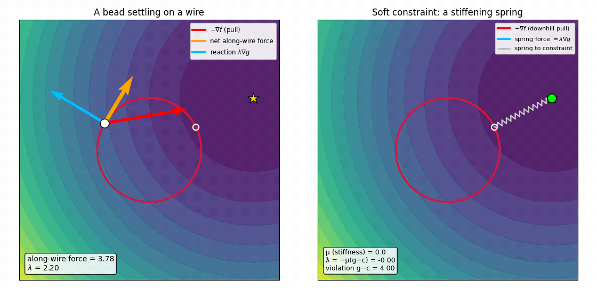
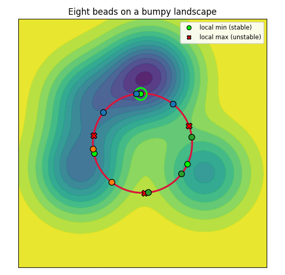

Every calculus course teaches the recipe. To solve

$$\min_{x,y}\; f(x,y)\quad\text{subject to}\quad g(x,y)=c,$$

you introduce a number $\lambda$, write down

$$\nabla f=\lambda\,\nabla g,\qquad g=c,$$

and solve. It works, and most of us turned the crank long before anyone explained
why the two gradients should end up parallel. The cleanest answer is mechanical
rather than algebraic: the recipe is a statement that forces are in equilibrium.
Once you see the picture, the formula stops being something to memorise and
becomes something you could have guessed.

Read the objective $f$ as a **potential energy**. A potential exerts a force
equal to minus its gradient,

$$\mathbf F = -\nabla f,$$

pointing "downhill", toward smaller $f$. Read the constraint $g(x,y)=c$ as a
**rigid wire**, the set of points you are allowed to occupy. Its gradient
$\nabla g$ points across that wire, because a gradient is always perpendicular to
its own level curve. Now thread a bead onto the wire. It feels the full pull
$\mathbf F$, but it can only slide along the wire.

Split the pull into two pieces, one along the wire and one across it. The across
piece is answered by the wire itself: a rigid wire responds to any sideways push
with an equal and opposite **reaction force**, and that reaction can only point
perpendicular to the wire, along $\nabla g$. Call it $\mathbf N=\lambda\,\nabla g$,
where the single number $\lambda$ says how hard the wire pushes and its sign says
which way. The along piece is the only force free to move the bead, so while any
along-wire force remains, the bead keeps sliding. The bead comes to rest exactly
when the along-wire force vanishes, when the entire pull is perpendicular to the
wire and hence parallel to $\nabla g$:

$$\underbrace{-\nabla f}_{\text{pull}}\;+\;\underbrace{\lambda\,\nabla g}_{\text{wire's reaction}}\;=\;\mathbf 0
\qquad\Longleftrightarrow\qquad \boxed{\;\nabla f=\lambda\,\nabla g\;}.$$

That is the Lagrange condition, and we reached it by balancing forces rather than
by algebra. The multiplier $\lambda$ measures something physical: the strength of
the constraint's reaction force.

A concrete case makes it tangible. Take an especially transparent objective, a
bowl that pulls everything toward a target point $\mathbf a=(2,1)$,

$$f(x,y)=(x-2)^2+(y-1)^2,\qquad -\nabla f = 2\,(\mathbf a-\mathbf x),$$

so the pull points straight at $\mathbf a$. Confine the bead to the **unit
circle** $g(x,y)=x^2+y^2=1$, whose gradient $\nabla g=2\,(x,y)$ points radially
outward. The answer is obvious to the eye, the point on the circle nearest
$\mathbf a$, which is why it is a good place to check the machinery. Solving
$\nabla f=\lambda\nabla g$ together with $g=1$ gives

$$\mathbf x^* = \frac{\mathbf a}{\lVert\mathbf a\rVert}\approx(0.894,\,0.447),
\qquad \lambda^* = 1-\lVert\mathbf a\rVert \approx -1.236.$$

The multiplier is negative: the wire has to push inward to hold the bead against a
pull that points outward toward $\mathbf a$.

Now release the bead and let it slide on the wire under the pull, with damping, so
that its velocity is proportional to force (picture a bead sinking through honey).
Three arrows are drawn at the bead. The
red arrow is $-\nabla f$, the
full pull of the objective. The
orange arrow is its along-wire
part, the net force that actually moves the bead, and it shrinks to zero. The
blue arrow is $\lambda\nabla g$,
the wire's reaction, always perpendicular to the wire.

When the bead stops, red and blue are equal and opposite, and the on-screen
$\lambda$ has arrived at the $\lambda^*\approx-1.24$ we computed. A bead found the
spot where the wire can absorb the entire pull, purely by sliding. We will watch
this settle in a moment, set beside a second and equivalent picture of the same
balance.

It is worth pausing on $\lambda$. Bundle the objective and the constraint into a
single landscape, the *Lagrangian*

$$\mathcal L(x,y;\lambda)=f(x,y)-\lambda\,\big(g(x,y)-c\big),$$

whose force is $-\nabla\mathcal L = -\nabla f + \lambda\nabla g$. Setting that to
zero is precisely the balance above, so $\lambda$ is the weight the constraint
carries in the combined potential: a larger $|\lambda|$ means a stiffer push is
needed to hold the bead in place.

A rigid wire is an idealisation. It is often more natural, and it is what we
actually do numerically, to make the constraint soft: replace the wire with a
spring that pulls the bead toward the constraint surface and charges an energy
penalty for drifting off it. The total energy becomes

$$E_\mu(x,y)=\underbrace{f(x,y)}_{\text{go downhill}}\;+\;\underbrace{\tfrac{\mu}{2}\big(g(x,y)-c\big)^2}_{\text{cost of leaving } g=c},$$

two energies in direct competition. The objective $f$ pulls the bead toward its
own minimum, while the spring term pulls it back onto $g=c$, and the stiffness
$\mu$ sets how expensive a violation is. The bead now roams the whole plane and
settles at the minimum of $E_\mu$, where the two forces cancel:

$$\nabla f + \mu\,(g-c)\,\nabla g = 0
\qquad\Longleftrightarrow\qquad
\nabla f = \underbrace{-\mu\,(g-c)}_{=\;\lambda}\,\nabla g.$$

Two things fall straight out. First, the multiplier is the spring's tension: at
the balance point the spring is stretched by $g-c$, and the restoring force it
delivers, $-\mu(g-c)\nabla g$, plays exactly the role the wire's reaction
$\lambda\nabla g$ did, so $\lambda=-\mu(g-c)$ is literally how hard the spring
pulls. Second, a soft constraint is slightly violated: at finite stiffness the
bead rests a little off the constraint, with $g-c\neq0$, which is the price of
softness. As you stiffen the spring and let $\mu\to\infty$, the violation
$g-c\to0$ while the product $\mu(g-c)$ stays finite and tends to $-\lambda^*$. The
rigid wire is simply the infinitely stiff spring limit.

In the right-hand panel of the figure below we crank up the stiffness $\mu$. The
bead starts at the unconstrained minimum of $f$ (the target $\mathbf a$, spring
slack, constraint badly violated) and is reeled onto the constraint as the spring
tightens; the effective multiplier $\lambda=-\mu(g-c)$ approaches
$\lambda^*\approx-1.24$ while the violation shrinks to zero. The left-hand panel is
the rigid wire from before, settling under the same pull, so the two mechanisms
can be watched together.

<figure style="text-align:center;margin:1.5em 0">

<figcaption style="font-size:0.9em;opacity:0.75;margin-top:0.5em;text-align:left"><strong>Two views of the same balance.</strong> On the left, a bead on a rigid wire: the objective's pull (red) splits into an along-wire part (orange) that dies to zero and a normal reaction (blue) that the wire supplies, so the bead rests where ∇f = λ∇g. On the right, the wire is replaced by a stiffening spring: as the stiffness μ grows the bead is reeled onto the constraint, and the spring tension −μ(g−c) approaches the same multiplier λ.</figcaption>
</figure>

This is exactly the penalty method of constrained optimisation, and the seed of
the augmented Lagrangian: trade a hard constraint for a stiff quadratic penalty,
and recover the multiplier as the penalty's tension in the stiff spring limit.
Hard wire and soft spring are two views of the same balance.

So far the objective has been convex, and then the balanced minimum is unique.
Real objectives are bumpy, and the same condition $\nabla f=\lambda\nabla g$ then
holds at several points on the wire: every valley bottom, a stable rest point, and
every ridge top, an unstable one, each with its own $\lambda$. (Even the convex
bowl already has two balance points on the circle, a near minimum and a far
maximum; what is unique for a convex objective is the minimum, not the balance.)
The force picture still holds; it simply gains more than one solution. The
mechanics also makes visible something you already know about gradient methods: a
force or gradient flow settles into whichever local minimum's basin it starts in.
This is simply how local methods behave, here and in ordinary gradient descent
alike.

In the animation, eight beads are released on a landscape of several wells. Green
dots mark stable minima, red crosses mark unstable maxima, and all of them satisfy
$\nabla f=\lambda\nabla g$. The beads split by basin, and some settle in shallower
minima rather than the deepest valley (the ringed global optimum), just as local
descent should behave. The forces are drawn as before: each bead carries its net
along-wire force in orange, which shrinks to zero as the bead settles, and the
white-ringed bead, the one heading for the deepest valley, also shows its full
pull $-\nabla f$ in red and the wire's reaction $\lambda\nabla g$ in blue, which
come into balance when it stops.

<figure style="text-align:center;margin:1.5em 0">

<figcaption style="font-size:0.9em;opacity:0.75;margin-top:0.5em;text-align:left">Every green dot and red cross is a force-balance point. Watch the orange along-wire forces die out as the beads settle; on the ringed bead, red pull and blue reaction end up equal and opposite. Maxima balance forces too; they are just unstable.</figcaption>
</figure>

The one distinction worth keeping straight is that force balance is stationarity,
a weaker property than optimality: maxima balance forces as well, and they are
merely unstable. Selecting
the global constrained optimum is then the usual separate job, whether by multiple
starts as here, by annealing, or by a global method, precisely as it is for
unconstrained gradient descent.

Here is the whole idea on one page:

| idea | in words | in symbols |
|---|---|---|
| objective = potential | it pulls the bead downhill | $\mathbf F=-\nabla f$ |
| constraint = wire | motion is confined to $g=c$; the wire pushes only sideways | $\mathbf N=\lambda\nabla g$ |
| equilibrium | rest when no force acts along the wire | $-\nabla f+\lambda\nabla g=\mathbf 0$ |
| the multiplier | strength (and sign) of the wire's reaction | $\lambda$ |
| tangency | at rest, a contour of $f$ just kisses the wire | $\nabla f\parallel\nabla g$ |

In one sentence, minimising $f$ on $g=c$ is letting a bead slide on a wire until
the objective's pull is entirely absorbed by the wire's reaction: the condition
$\nabla f=\lambda\nabla g$ is that force balance, and $\lambda$ is how hard the
wire pushes. For convex $f$ the balanced minimum is the answer; for bumpy $f$
there are several, and local sliding finds one of them.
