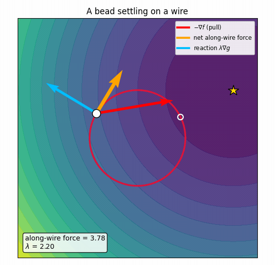

Every calculus course teaches the recipe. To solve

$$\min_{x,y}\; f(x,y)\quad\text{subject to}\quad g(x,y)=c,$$

you introduce a number $\lambda$, write down

$$\nabla f=\lambda\,\nabla g,\qquad g=c,$$

and solve. It works, and most of us learned to turn the crank without ever being
told *why* the two gradients should end up parallel. The cleanest answer isn't
algebraic at all. It's mechanical: **the recipe is a statement that forces are in
equilibrium.** Once you see the picture, the formula stops being something to
memorise and becomes something you could have guessed.

## One idea: a bead threaded on a wire

Read the objective $f$ as a **potential energy**. A potential exerts a force
equal to minus its gradient,

$$\mathbf F = -\nabla f,$$

pointing "downhill", toward smaller $f$. Read the constraint $g(x,y)=c$ as a
**rigid wire** — the set of points you are allowed to occupy. Its gradient
$\nabla g$ points *across* that wire, because a gradient is always perpendicular
to its own level curve. Now thread a bead onto the wire. It feels the full pull
$\mathbf F$, but it can only slide *along* the wire.

Split the pull into two pieces — one **along** the wire, one **across** it:

- The **across** piece is answered by the wire itself. A rigid wire responds to
  any sideways push with an equal and opposite **reaction force**, and that
  reaction can only point perpendicular to the wire — i.e. along $\nabla g$. Call
  it $\mathbf N=\lambda\,\nabla g$, where the single number $\lambda$ says *how
  hard* the wire pushes and its sign says *which way*.
- The **along** piece is the only force free to move the bead. As long as it is
  non-zero, the bead keeps sliding.

So the bead comes to rest exactly when the along-wire force vanishes — when the
entire pull is perpendicular to the wire, hence parallel to $\nabla g$:

$$\underbrace{-\nabla f}_{\text{pull}}\;+\;\underbrace{\lambda\,\nabla g}_{\text{wire's reaction}}\;=\;\mathbf 0
\qquad\Longleftrightarrow\qquad \boxed{\;\nabla f=\lambda\,\nabla g\;}.$$

That is the Lagrange condition, and we did not do any algebra to get it — we
balanced forces. The multiplier $\lambda$ was never bookkeeping; it is the
**strength of the constraint's reaction force**.

## A worked example to keep in mind

Take the most transparent objective imaginable: a bowl that pulls everything
toward a target point $a=(2,1)$,

$$f(x,y)=(x-2)^2+(y-1)^2,\qquad -\nabla f = 2\,(a-\mathbf x),$$

so the pull points straight at $a$. Confine the bead to the **unit circle**
$g(x,y)=x^2+y^2=1$, whose gradient $\nabla g=2\,(x,y)$ points radially outward.
The answer is obvious to the eye — the point on the circle nearest $a$ — which is
exactly why it's a good place to check the machinery. Solving
$\nabla f=\lambda\nabla g$ together with $g=1$ gives

$$\mathbf x^* = \frac{a}{\lVert a\rVert}\approx(0.894,\,0.447),
\qquad \lambda^* = 1-\lVert a\rVert \approx -1.236.$$

The multiplier is *negative*: the wire has to push **inward** to hold the bead
against a pull that points outward toward $a$.

## Watch the forces balance

Release the bead and let it slide on the wire under the pull, with a little
damping (imagine a bead in honey, so velocity is proportional to force). Three
arrows are drawn at the bead:

- red $=-\nabla f$, the full
  pull of the objective;
- orange, its **along-wire**
  part — the net force that actually moves the bead. *It shrinks to zero.*
- blue $=\lambda\nabla g$, the
  wire's **reaction**, always perpendicular to the wire.

When the bead stops, red and blue are equal and opposite, and the on-screen
$\lambda$ has arrived at the $\lambda^*\approx-1.24$ we computed. Nothing was
minimised by formula — a bead simply found the spot where the wire can absorb the
entire pull.

**What is $\lambda$, really?** Bundle both potentials into one landscape, the
*Lagrangian*

$$\mathcal L(x,y;\lambda)=f(x,y)-\lambda\,\big(g(x,y)-c\big),$$

whose force is $-\nabla\mathcal L = -\nabla f + \lambda\nabla g$. Setting that to
zero is precisely the balance above. So $\lambda$ is the **weight the constraint
carries** in the combined potential: a larger $|\lambda|$ means a stiffer push is
required to hold the bead in place.

## One honest caveat: bumpy landscapes

If $f$ is **convex**, the balanced point is unique and it is the answer. Real
objectives are bumpy, and then the balance condition $\nabla f=\lambda\nabla g$
holds at **many** points on the wire — every valley bottom (a *stable* rest
point) *and* every ridge top (an *unstable* one), each with its own $\lambda$.
Damped sliding only finds the bottom of the basin it happens to start in.

Below, eight beads are released on a landscape of several wells. Green dots mark
stable minima, red crosses mark unstable maxima — **all** of them satisfy
$\nabla f=\lambda\nabla g$. The beads split by basin, and several settle into
shallower minima, never reaching the deepest valley (the ringed global optimum).

 balance forces too — they are simply unstable, so any nudge sends the bead downhill.")

This is the honest scope of the picture. Force balance is **stationarity**, not
optimality; it is the *damping* that selects a minimum, and only a **local** one.
Finding the *global* constrained optimum needs more than local sliding —
multiple starts (as here), annealing, or a genuinely global method.

## The whole idea, on one page

| idea | in words | in symbols |
|---|---|---|
| objective = potential | it pulls the bead downhill | $\mathbf F=-\nabla f$ |
| constraint = wire | motion is confined to $g=c$; the wire pushes only sideways | $\mathbf N=\lambda\nabla g$ |
| equilibrium | rest when no force acts *along* the wire | $-\nabla f+\lambda\nabla g=\mathbf 0$ |
| the multiplier | strength (and sign) of the wire's reaction | $\lambda$ |
| tangency | at rest, a contour of $f$ just kisses the wire | $\nabla f\parallel\nabla g$ |

**In one sentence:** minimising $f$ on $g=c$ is letting a bead slide on a wire
until the objective's pull is entirely absorbed by the wire's reaction — the
condition $\nabla f=\lambda\nabla g$ *is* that force balance, and $\lambda$ is how
hard the wire pushes. For convex $f$ the balanced point is the answer; for bumpy
$f$ there are many, and local sliding finds only one.
